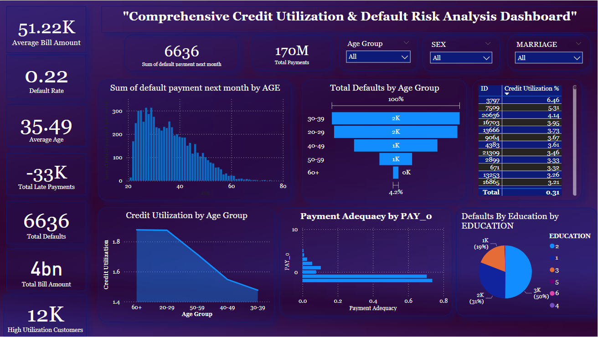

# Predictive Analytics for Banking: Addressing Default Risks and Enhancing Customer Insights”

## Overview  
This project is an in-depth analysis of credit card customer data, aimed at understanding repayment behaviors, predicting default risks, and identifying actionable insights to enhance financial decision-making. Through machine learning, statistical analysis, and visualization tools, the project addresses five key problem statements, providing valuable insights for financial institutions.

---

## Problem Statements

### 1. **Predicting Default Risks**  
   - **Objective:** Predict whether a customer will default on their payment in the next month.  
   - **Tools & Techniques Used:**  
     - Logistic Regression for binary classification.  
     - Random Forest and Decision Tree models for comparative analysis.  
     - Evaluation Metrics: Accuracy, Precision, Recall, F1-Score, and ROC-AUC.  
   - **Outcome:** Identified a reliable model to predict defaults, aiding proactive risk management.

### 2. **Analyzing Repayment Behavior**  
   - **Objective:** Analyze repayment trends and detect anomalies.  
   - **Tools & Techniques Used:**  
     - Exploratory Data Analysis (EDA) with visualizations.  
     - Time-series analysis using ARIMA models.  
     - Anomaly detection with interquartile range (IQR).  
   - **Outcome:** Highlighted patterns of delayed payments and anomalies, enabling targeted interventions.

### 3. **Customer Segmentation**  
   - **Objective:** Segment customers into risk profiles to enhance personalized financial strategies.  
   - **Tools & Techniques Used:**  
     - K-Means Clustering for segmentation.  
     - Dimensionality reduction using PCA for visualization.  
     - Interactive dashboards created in Tableau.  
   - **Outcome:** Segmented customers into Low Risk, Medium Risk, and High Risk groups for tailored solutions.

### 4. **Forecasting Monthly Bills**  
   - **Objective:** Predict future bill amounts to improve financial planning.  
   - **Tools & Techniques Used:**  
     - Random Forest Regressor for bill forecasting.  
     - Evaluation Metrics: R² and RMSE.  
     - Hyperparameter tuning using GridSearchCV.  
   - **Outcome:** Accurate predictions of monthly bills for better resource allocation.

### 5. **Exploring Gender-Specific Risk Factors**  
   - **Objective:** Understand how gender impacts credit risk and repayment behavior.  
   - **Tools & Techniques Used:**  
     - Statistical testing (t-tests) to analyze differences between genders.  
     - Visualizations to compare default rates by gender.  
   - **Outcome:** Identified significant gender-based differences in default rates.

---

## Tools and Libraries Used

### Programming and Analysis  
- **Python**: pandas, matplotlib, seaborn, sklearn, statsmodels, numpy.  
- **Machine Learning Models**: Logistic Regression, Random Forest, Decision Tree, ARIMA.  

### Visualization  
- **Matplotlib and Seaborn**: For detailed analysis visualizations.  
- **PowerBI**: To create interactive dashboards.

### Other Tools  
- **Orange**: For workflow-based machine learning modeling.  
- **Excel**: For initial data cleaning and pivot tables.  

---

## Key Insights

1. **Default Risk Prediction:** Random Forest showed the best performance for predicting default risks, with an F1-score of 0.462.  
2. **Repayment Behavior:** ARIMA models highlighted a decreasing trend in bill amounts over time, signaling improved repayment behavior.  
3. **Customer Segmentation:** Effective clustering identified groups with distinct risk profiles, enabling targeted financial strategies.  
4. **Forecasting Monthly Bills:** Random Forest Regressor provided reliable bill predictions, facilitating proactive resource management.  
5. **Gender Analysis:** Female customers had significantly lower default rates compared to males, indicating potential gender-specific financial behaviors.  

---

## Dashboard and Orange Workflow  

### PowerBI Dashboard  
The project includes a detailed interactive dashboard created in PowerBI, showcasing repayment trends, customer segments, and gender-specific insights. Below is a sample view of the dashboard:

### Orange Workflow  
The machine learning workflow for Predicting Default Risks was created in Orange. Below is an image of the workflow:  

---
